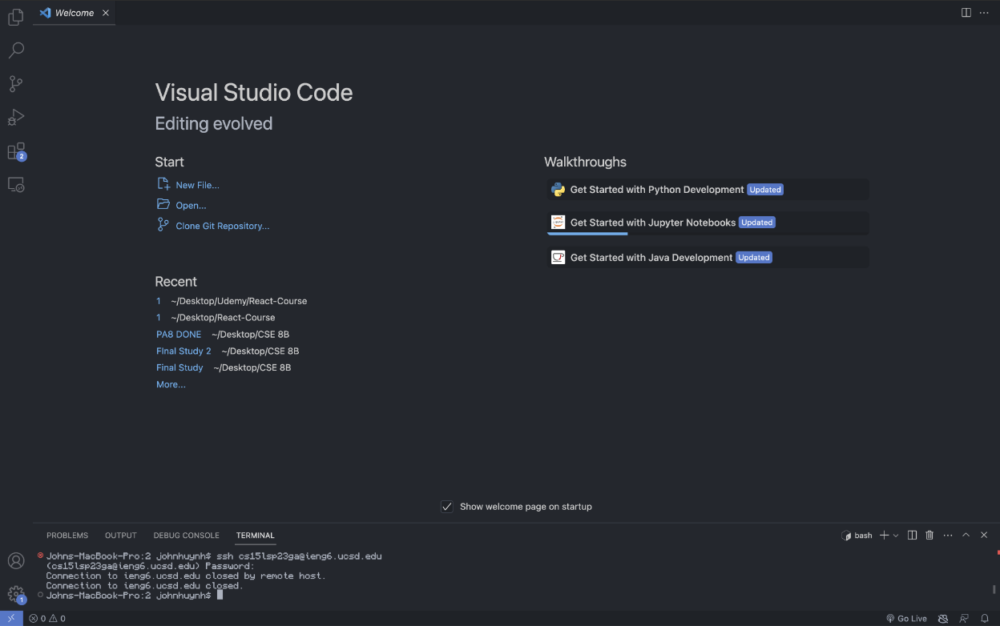
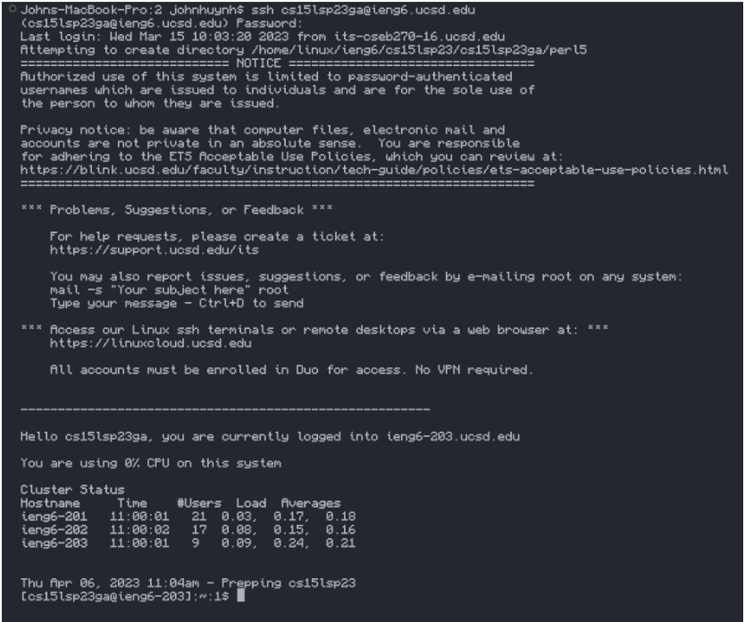
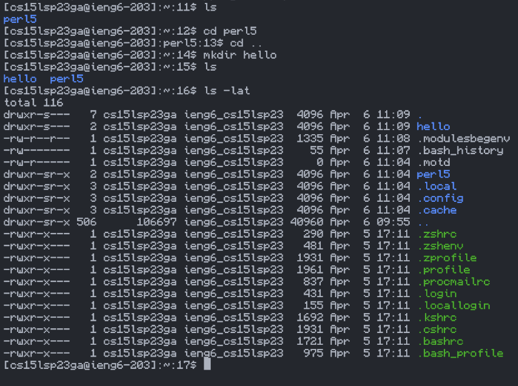

## Lab Report 1
---

Step 1: Installing Visual Studio Code
---

* If you already have Visual Studio Code installed from CSE 8B you can skip this step entirely
* Go to this [Link](https://code.visualstudio.com/) to download Visual Studio Code
* If you are using Windows you have to download [git](https://gitforwindows.org/) and [bash](https://stackoverflow.com/a/50527994)
* If you are using Unix or Linux you can continue to the next step

Step 2: Connecting to the Remote Server
---

* Use $ ssh cs15lsp23zz@ieng6.ucsd.edu (zz should be your course specific account)
* Your command line should look similar to the one in the picture above
* If it states that it was closed by the remote user, wait about 15-25 mins and try again

Step 3: Running Commands in the Terminal
---

* Try some commands in the command line to get yourself familiar
* Test multiple cases that seem different from the standard to see how the command line reacts
* Some commands include cd, ls, pwd, mkdir, and cp
